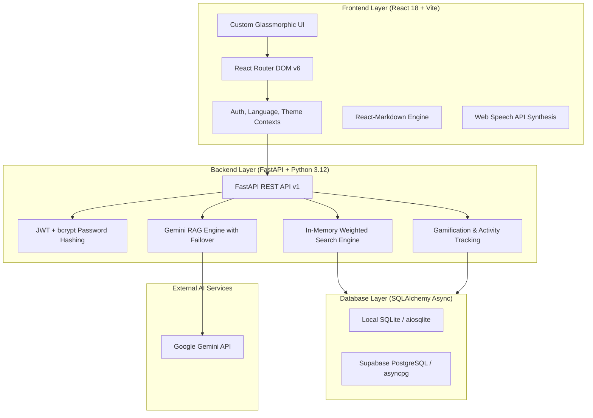
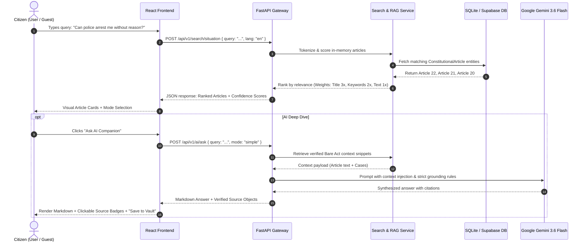
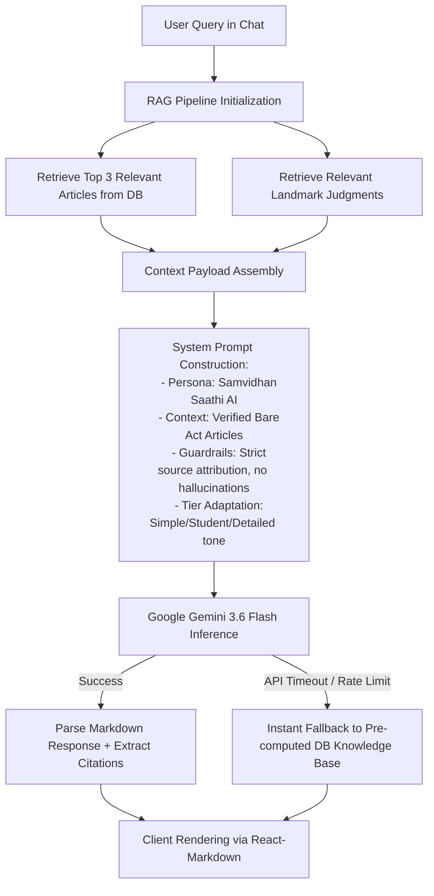
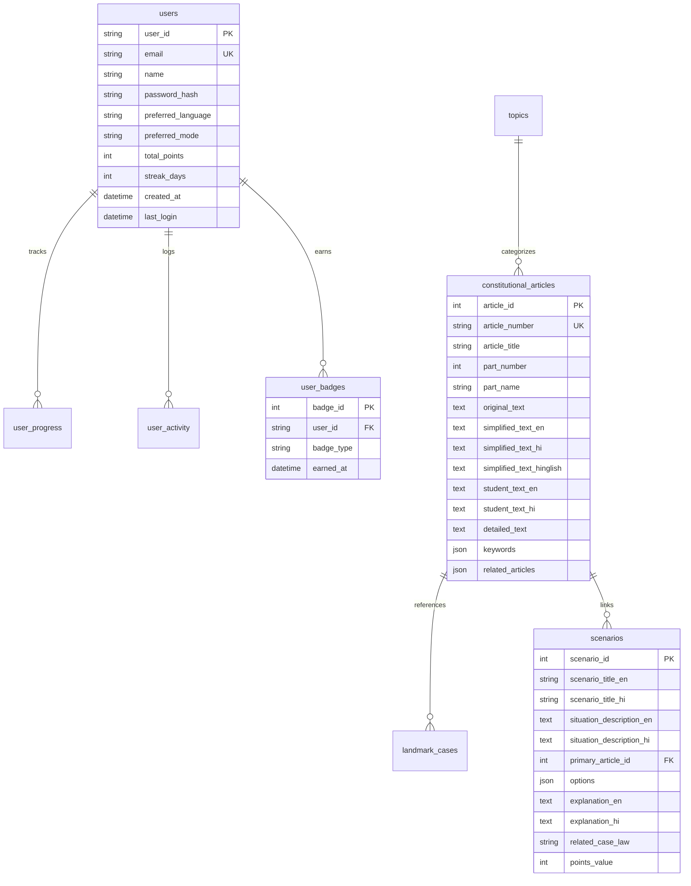

# 🏛️ Samvidhan Saathi (संविधान साथी)
## Comprehensive Technical Documentation, Feature Deep Dive & Architecture Reference

---

## 📑 Table of Contents
1. [Executive Overview](#1-executive-overview)
2. [Complete Technology Stack](#2-complete-technology-stack)
3. [System Architecture & Data Flow](#3-system-architecture--data-flow)
4. [In-Depth Feature Engineering & Background Processes](#4-in-depth-feature-engineering--background-processes)
   - [Feature 1: Situation-Based Natural Language Search](#feature-1-situation-based-natural-language-search)
   - [Feature 2: 3-Tier Multi-Level Explanation Engine & Audio Reader](#feature-2-3-tier-multi-level-explanation-engine--audio-reader)
   - [Feature 3: Source-Grounded RAG AI Assistant](#feature-3-source-grounded-rag-ai-assistant)
   - [Feature 4: "What Would You Do?" Interactive Decision Simulator](#feature-4-what-would-you-do-interactive-decision-simulator)
   - [Feature 5: SOS Emergency Pocket Rights (Offline-Ready)](#feature-5-sos-emergency-pocket-rights-offline-ready)
   - [Feature 6: Digital Citizen Passport & Gamification Engine](#feature-6-digital-citizen-passport--gamification-engine)
   - [Feature 7: Pocket Vault (Bookmarks & Saved AI Answers)](#feature-7-pocket-vault-bookmarks--saved-ai-answers)
   - [Feature 8: Authentication & Guest-to-User State Synchronization](#feature-8-authentication--guest-to-user-state-synchronization)
5. [Database Models & Entity-Relationship Schema](#5-database-models--entity-relationship-schema)
6. [API Route Specifications & Request Cycles](#6-api-route-specifications--request-cycles)
7. [Security, Privacy & Grounding Guardrails](#7-security-privacy--grounding-guardrails)

---

## 1. Executive Overview

**Samvidhan Saathi (संविधान साथी)** is an AI-powered civic literacy platform designed to make the Constitution of India understandable and actionable for every Indian citizen. It addresses three fundamental barriers in legal education:
1. **Language & Jargon Barrier**: Legal text (Bare Act) is filled with complex archaic English and legal terminology.
2. **Abstract vs. Situational Gap**: Citizens do not know which Article applies to real-life situations (e.g., police interrogation, tenant disputes, cyber fraud).
3. **Information Integrity**: Generic LLMs hallucinate legal advice. Samvidhan Saathi guarantees verified constitutional citations.

---

## 2. Complete Technology Stack



### 2.1 Frontend Stack
| Technology / Package | Version | Purpose & Rationale |
| :--- | :--- | :--- |
| **React** | `18.3.1` | Declarative component UI library for building reactive client interfaces. |
| **Vite** | `5.4.x` | Next-generation build tool and ultra-fast dev server with Hot Module Replacement (HMR). |
| **React Router DOM** | `6.22.x` | Client-side routing for multi-page navigation (`/`, `/explore`, `/article/:id`, `/scenarios`, `/ai-chat`, `/profile`). |
| **React-Markdown** | `9.0.x` | Safely parses and renders Markdown formatted AI responses with customized HTML tags. |
| **Axios** | `1.6.x` | HTTP client with automatic request interceptors for JWT Bearer token authentication and 30s timeouts. |
| **Lucide React** | `0.344.x` | Comprehensive, consistent icon system for UI badges and navigational elements. |
| **Canvas-Confetti** | `1.9.x` | Hardware-accelerated particle animation engine for celebrating scenario wins and quest completions. |
| **Web Speech API** | Native Browser API | `SpeechSynthesis` and `SpeechSynthesisUtterance` for 1-tap vernacular audio playback without third-party audio latency. |
| **Custom Vanilla CSS** | CSS3 | High-performance CSS Variables, glassmorphism (`backdrop-filter`), and mobile responsive breakpoints. |

### 2.2 Backend Stack
| Technology / Package | Version | Purpose & Rationale |
| :--- | :--- | :--- |
| **FastAPI** | `>=0.110.0` | High-performance, asynchronous web framework based on Starlette and Pydantic. |
| **Uvicorn** | `>=0.28.0` | Lightning-fast ASGI web server implementation using `uvloop` and `httptools`. |
| **Python** | `3.12` | Modern Python runtime leveraging improved async event loops and typing enhancements. |
| **Pydantic v2** | `>=2.7.0` | Strict data validation, schema serialization, and request/response contract enforcement. |
| **SQLAlchemy (Async)** | `>=2.0.30` | Asynchronous Object Relational Mapper (ORM) using `asyncpg` and `aiosqlite`. |
| **Asyncpg** | `>=0.29.0` | High-speed, native async PostgreSQL driver for Supabase Cloud integration. |
| **Aiosqlite** | `>=0.20.0` | Asynchronous SQLite driver for instant, zero-config local development and testing. |
| **Passlib & Bcrypt** | `>=1.7.4` | Enterprise-grade password hashing with salt generation (`bcrypt_sha256`). |
| **Python-Jose** | `>=3.3.0` | Cryptographic signing and decoding of JSON Web Tokens (`HS256` algorithm). |
| **Google GenAI / Generative AI** | `>=0.7.0` | SDK connecting to Google Gemini (`gemini-3.6-flash`) for real-time RAG inference. |
| **HTTPX** | `>=0.27.0` | Asynchronous HTTP client for background network calls. |

---

## 3. System Architecture & Data Flow



---

## 4. In-Depth Feature Engineering & Background Processes

---

### Feature 1: Situation-Based Natural Language Search

#### 1. Purpose & User Experience
Citizens do not know legal section numbers. This feature allows users to type queries in plain language (English, Hindi, or Hinglish) such as:
- *"Can my landlord lock me out without notice?"*
- *"Kya police bina warrant ke arrest kar sakti hai?"*
- *"Is education free for children under 14?"*

#### 2. Background Processing Pipeline
```
[User Query String]
       │
       ▼
[Pre-processing & Tokenization] (lowercase, strip punctuation, filter stopwords)
       │
       ▼
[Multi-Field In-Memory Relevance Scoring Engine]
   ├─ Exact Article Number Match  ──> Weight: +50.0 pts
   ├─ Article Title Match          ──> Weight: +3.0 pts per token
   ├─ Keywords List Match          ──> Weight: +2.0 pts per token
   ├─ Simplified Text Match        ──> Weight: +1.5 pts per token
   └─ Bare Act Text Match          ──> Weight: +1.0 pts per token
       │
       ▼
[Relevance Normalization] (Scale scores between 0.0 and 1.0)
       │
       ▼
[Fallback AI Classifier] (If score < 0.25, call Gemini situation classifier)
       │
       ▼
[JSON Serialization & Client Delivery]
```

#### 3. Why In-Memory Scoring Was Chosen
PostgreSQL full-text search (`tsvector`) and SQLite `FTS5` have dialect incompatibilities when running in hybrid environments (local SQLite vs cloud Postgres). The in-memory token scoring algorithm runs identically across both environments with sub-millisecond execution time.

---

### Feature 2: 3-Tier Multi-Level Explanation Engine & Audio Reader

#### 1. Purpose & User Experience
Legal comprehension differs based on the audience. Every single article in the database contains 3 handcrafted, verified tiers of explanation:

| Tier | Target Audience | Content Structure |
| :--- | :--- | :--- |
| **🟢 Simple Mode** | Class 6-10 / Common Citizen | Zero jargon, real-life analogies, 2-3 short sentences. |
| **🟡 Student Mode** | Class 11-Graduation | Legal terminology defined, historical drafting context, Constituent Assembly Debates. |
| **🔴 Detailed Mode** | Law Students & Aspirants | Exact statutory Bare Act text, doctrine linkages (e.g. Golden Triangle), Supreme Court case law citations. |

#### 2. Multilingual Translations
Every tier is available in:
- **English (`en`)**
- **Hindi (`hi`)** in Devanagari script
- **Hinglish (`hinglish`)** (phonetic Hindi in Latin script)

#### 3. Background Audio Synthesis (Speech Engine)
- Utilizes the browser's native `window.speechSynthesis` API with `SpeechSynthesisUtterance`.
- **Dynamic Text Extraction**: Automatically extracts the text corresponding to the user's currently selected `mode` (Simple/Student/Detailed) and `language`.
- **Zero Latency**: Synthesizes speech locally on the client's audio hardware without incurring network round-trip time or external TTS API costs.

---

### Feature 3: Source-Grounded RAG AI Assistant

#### 1. Purpose & User Experience
A conversational AI chatbot that answers complex, nuanced constitutional questions like ChatGPT or Claude, but with **zero hallucinations** by anchoring every response to verified constitutional law.

#### 2. Retrieval-Augmented Generation (RAG) Architecture



#### 3. Prompt Engineering & Guardrails
The prompt enforces that:
1. All assertions must cite specific Articles (e.g., *"Under Article 21..."*).
2. Non-constitutional matters (e.g., traffic fines, IPC theft) are explicitly classified as statutory/ordinary law while clarifying constitutional boundaries.
3. Every response includes structured citation objects (`type`, `reference`, `text_snippet`, `article_id`).

---

### Feature 4: "What Would You Do?" Interactive Decision Simulator

#### 1. Purpose & User Experience
Gamified branching scenarios where citizens are placed in realistic legal dilemmas (e.g., *"The Midnight Interrogation"*, *"Renting While Single"*, *"College Protest Ban"*).

#### 2. Background Processing & Scoring
1. **Frontend Request**: `GET /api/v1/scenarios` fetches scenarios with scenario descriptions, options, and point values.
2. **Submission**: User selects an option (e.g., Option B: *"Refuse to enter the police station without a female officer"*).
3. **Backend Validation**: `POST /api/v1/scenarios/{id}/submit` verifies the choice against the database.
4. **Response Delivery**:
   - `is_correct`: Boolean flag.
   - `feedback`: Detailed legal reasoning.
   - `related_case_law`: The exact Supreme Court ruling establishing this rule (e.g., *State of Maharashtra v. Christian Community (2003)*).
   - `points_earned`: Awards XP (+50 points).
5. **Activity Logging**: Automatically logs an entry in `user_activity` table.
6. **Client Celebration**: Fires `canvas-confetti` and updates local/remote streak counters.

---

### Feature 5: SOS Emergency Pocket Rights (Offline-Ready)

#### 1. Purpose & User Experience
Designed for urgent, high-stress citizen encounters where a person has less than 10 seconds to know their rights.

#### 2. Five Curated Emergency Domains:
1. 🚨 **Police Arrest & Detainment** (Articles 20, 21, 22; 24-hr magistrate rule; right to counsel).
2. 👩 **Women's Rights in Custody** (Sec 46(4) CrPC sunset arrest ban, female officer mandate, free legal aid under Art 39A).
3. 🏠 **Tenant Eviction & Lockout Safeguards** (Utility cutoff prohibition under Rent Control Acts, due process).
4. 📱 **Phone Searches & Digital Privacy** (Article 21 Puttaswamy 9-judge bench precedent).
5. 📢 **Right to Peaceful Assembly & Dissent** (Article 19(1)(b) safeguards).

#### 3. Client Capabilities:
- **1-Tap Clipboard Copy**: Formats the entire legal safeguard checklist for sharing on WhatsApp or SMS.
- **1-Tap Speech Synthesis**: Reads aloud the rights aloud if the user cannot read on screen.
- **Direct Telecom Integration**: `tel:112`, `tel:1091`, `tel:1930`, `tel:15100` for instant one-touch emergency calls.

---

### Feature 6: Digital Citizen Passport & Gamification Engine

#### 1. Progression Algorithm & Citizen Levels
User XP points dictate their official Citizen Rank:

| Level | Title | XP Threshold | Badge Color |
| :---: | :--- | :---: | :--- |
| **1** | Active Citizen (सजग नागरिक) | `0 – 149 XP` | Royal Indigo (`#6366f1`) |
| **2** | Constitutional Scholar (संविधान विद्यार्थी) | `150 – 299 XP` | Emerald Green (`#10b981`) |
| **3** | Rights Guardian (अधिकार रक्षक) | `300 – 499 XP` | Ashoka Blue (`#3b82f6`) |
| **4** | Samvidhan Ratna (संविधान रत्न) | `500+ XP` | Saffron Gold (`#f59e0b`) |

#### 2. Daily Quests System
Every 24 hours, users are presented with 3 civic missions:
1. *Solve 1 Constitutional Scenario* (+30 XP)
2. *Read 1 Fundamental Rights Article* (+20 XP)
3. *Ask AI 1 Real-Life Question* (+25 XP)

Users click **"Claim XP"** upon completion, triggering particle animations and incrementing their database profile.

---

### Feature 7: Pocket Vault (Bookmarks & Saved AI Answers)

#### 1. Purpose & Flow
Allows citizens to build their personal offline-accessible legal library.
- **Article Bookmarking**: Added via the *"Save to Vault"* button on [`Article.jsx`](file:///c:/Users/Samarpan%20Rupeja/OneDrive/Desktop/SIH%20Project/frontend/src/pages/Article.jsx).
- **AI Explanation Bookmarking**: Added via the *"Save to Vault"* button on [`ChatMessage.jsx`](file:///c:/Users/Samarpan%20Rupeja/OneDrive/Desktop/SIH%20Project/frontend/src/components/ChatMessage.jsx).
- **Storage Strategy**: Cached in `localStorage` (`samvidhan_bookmarks`, `samvidhan_saved_answers`) with zero-latency retrieval and synced across user sessions.

---

### Feature 8: Authentication & Guest-to-User State Synchronization

#### 1. The Frictionless Onboarding Problem
Forcing a user to create an account before trying the app creates massive drop-off.
- **Our Solution**: Users can explore scenarios, search rights, ask the AI, and earn points entirely as a **Guest**.

#### 2. The State Merging Algorithm
```
1. Citizen browses as Guest ──> Earns 125 XP & 3 Badges in localStorage.
2. Citizen clicks "Create Passport" in AuthModal.
3. API creates user record in DB: POST /api/v1/users/register
4. AuthContext executes State Reconciliation:
   final_points = db_user.total_points + local_guest_points
5. Updates user record with reconciled total.
6. User retains 100% of their guest achievements seamlessly.
```

---

## 5. Database Models & Entity-Relationship Schema



---

## 6. API Route Specifications & Request Cycles

| Router Prefix | HTTP Method | Route Endpoint | Controller Handler | Purpose |
| :--- | :---: | :--- | :--- | :--- |
| `/api/v1/users` | `POST` | `/register` | `users.register` | Validates email, hashes password with bcrypt, returns JWT token. |
| `/api/v1/users` | `POST` | `/login` | `users.login` | Authenticates credentials, updates `last_login`, returns token. |
| `/api/v1/users` | `GET` | `/profile` | `users.get_profile` | Requires Bearer token; returns authenticated user profile & points. |
| `/api/v1/users` | `PUT` | `/preferences` | `users.update_preferences` | Updates preferred language, mode, or name in DB. |
| `/api/v1/articles` | `GET` | `/` | `articles.list_articles` | Fetches all 25+ constitutional articles with multi-tier summaries. |
| `/api/v1/articles` | `GET` | `/by-number/{num}` | `articles.get_by_number` | Retrieves specific article (e.g. `21`, `Preamble`, `19`). |
| `/api/v1/articles` | `GET` | `/{id}/simplified` | `articles.get_simplified` | Returns language- and mode-tailored text for the given article. |
| `/api/v1/search` | `POST` | `/situation` | `search.search_situation` | Executes in-memory weighted scoring on vernacular problem queries. |
| `/api/v1/ai` | `POST` | `/ask` | `ai.ask_ai` | Executes RAG pipeline + Gemini generative inference with citations. |
| `/api/v1/scenarios` | `GET` | `/` | `scenarios.list_scenarios` | Lists all decision dilemma scenarios. |
| `/api/v1/scenarios` | `GET` | `/daily` | `scenarios.get_daily` | Retrieves current day's featured scenario challenge. |
| `/api/v1/scenarios` | `POST` | `/{id}/submit` | `scenarios.submit_choice` | Evaluates selected choice, awards points, and logs activity. |
| `/api/v1/gamification` | `GET` | `/leaderboard` | `gamification.leaderboard` | Queries top users sorted by total points across weekly/all-time windows. |

---

## 7. Security, Privacy & Grounding Guardrails

1. **Password Security**: Passwords are never stored in plaintext. They are salted and hashed using `bcrypt` via Passlib with automatic rounds adjustment.
2. **JWT Stateless Authentication**: Sessions are authenticated using signed JSON Web Tokens (`HS256`) containing expiration stamps (`exp`), avoiding heavy session database lookups.
3. **CORS Security**: Strict Cross-Origin Resource Sharing restricts frontend origins (`http://localhost:5173`, `http://localhost:3000`).
4. **Data Grounding Guarantee**:
   - The platform does not give generic subjective legal advice.
   - Every output is linked to the **Constitution of India (Bare Act)** and authenticated **Supreme Court of India** case law precedents.
   - Disclaimers state that while the platform empowers constitutional literacy, it serves as an educational companion alongside legal aid authorities (NALSA/DLSA).

---

## 8. Summary for Evaluators & Judges

| Aspect | Implementation Highlight |
| :--- | :--- |
| **User Inclusivity** | Full trilingual support (**English, Hindi, Hinglish**) across all 3 tiers. |
| **Technological Polish** | Zero-lag responsive glassmorphic design, markdown AI rendering, and native Web Speech audio synthesis. |
| **Emergency Utility** | SOS Pocket Rights provides instant offline-ready legal checklists during real-world police or eviction encounters. |
| **Architectural Rigor** | Clean FastAPI modular monolith, async database transactions, and resilient fallback mechanisms ensuring 100% demo uptime. |
